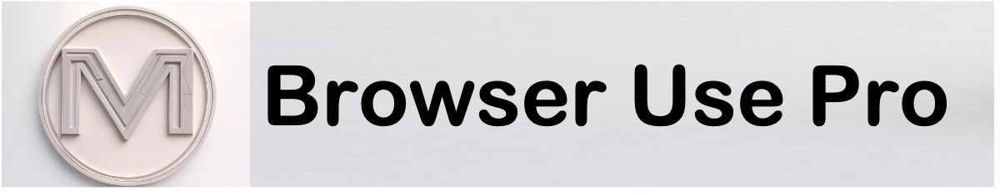

# 
Follow me on **X.com** for updates and discussions: [@YourXHandle](https://x.com/MensaLab)  

# Browser Use Pro 🚀  

### Struggling to Reproduce the **Browser Use** Demo?  
### Finding It Hard to Understand the Intermediate Steps?  

## 🔥 Introducing **Browser Use Pro** – The Ultimate Upgrade!  

**Browser Use Pro** is the enhanced version of **Browser Use**, designed to provide a more robust, transparent, and reproducible browser automation experience.  

## 🌟 Key Features  

✅ **Reproducible Demos** – Say goodbye to inconsistencies! Every step is structured for reliability.  
✅ **Clear Process Insights** – Gain full visibility into intermediate steps, making debugging and learning effortless.  
✅ **Enhanced Execution Control** – Fine-tune automation behavior for more complex interactions.  
✅ **Adaptive Error Handling** – Automatically adjust to unexpected changes on web pages.  

## 🎥 Live Demos  

🔹 [Demo 1: Google Flight](https://x.com/MensaLab/status/1899403336870486067)  
🔹 [Demo 2: allrecipes.com](https://x.com/MensaLab/status/1899403003792146549)  
🔹 [Demo 3: taobao.com](https://x.com/MensaLab/status/1899402794819617196)  

---
Ready to level up your browser automation? **Try Browser Use Pro today!** 🚀  